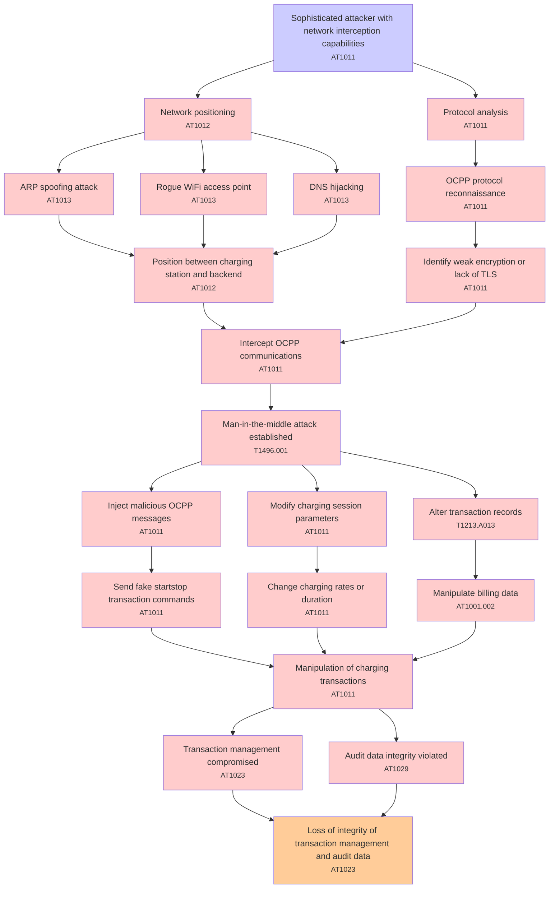

# Attack Tree: Communication Security

**Threat ID**: T003  
**Associated threat statement**: T003 - Communication Security

- **Threat Source**: sophisticated attacker
- **Prerequisites**: network interception capabilities
- **Threat Action**: perform man-in-the-middle attacks on OCPP communications
- **Threat Impact**: manipulation of charging transactions
- **Reduced Goal**: integrity
- **Impacted Assets**: transaction management and audit data
- **Priority**: High
- **Category**: Communication Security

---

## Attack Tree Diagram

## Attack Path Analysis

This attack tree represents the potential attack paths for the identified threat. Each node in the tree represents either:
- **Attack Goal** (orange): The ultimate objective
- **Attack Step** (red): Individual attack actions
- **Fact/Condition** (blue): Prerequisites or conditions
- **Mitigation** (green): Defensive measures

Review this attack tree to:
1. Identify critical attack paths
2. Implement appropriate security controls
3. Monitor for indicators of these attack patterns
4. Develop incident response procedures

---
*Generated by ThreatForest - Attack Tree Analysis*

## TTC Technique Mappings

| Attack Step | Technique ID | Technique Name | Confidence | Similarity |
|-------------|--------------|----------------|------------|------------|
| Loss of integrity of transaction management and au... | AT1023 | Cloud Database Discovery... | 🟡 medium | 0.621 |
| Intercept OCPP communications... | AT1011 | Operation Rate Control... | 🟡 medium | 0.539 |
| Network positioning... | AT1012 | Region Selection and Hopping... | 🟡 medium | 0.609 |
| OCPP protocol reconnaissance... | AT1011 | Operation Rate Control... | 🟡 medium | 0.654 |
| Alter transaction records... | T1213.A013 | RDS Instance Manipulation... | 🔴 low | 0.453 |
| Change charging rates or duration... | AT1011 | Operation Rate Control... | 🟡 medium | 0.556 |
| Position between charging station and backend... | AT1012 | Region Selection and Hopping... | 🟡 medium | 0.510 |
| Identify weak encryption or lack of TLS... | AT1011 | Operation Rate Control... | 🟡 medium | 0.598 |
| Rogue WiFi access point... | AT1013 | User Agent Spoofing and Randomization... | 🟡 medium | 0.628 |
| Audit data integrity violated... | AT1029 | Data from Cloud Database... | 🟡 medium | 0.636 |
| Protocol analysis... | AT1011 | Operation Rate Control... | 🟡 medium | 0.645 |
| Manipulate billing data... | AT1001.002 | Modify Existing Lambda Function... | 🔴 low | 0.456 |
| Man-in-the-middle attack established... | T1496.001 | Compute Hijacking... | 🟡 medium | 0.632 |
| Modify charging session parameters... | AT1011 | Operation Rate Control... | 🔴 low | 0.468 |
| DNS hijacking... | AT1013 | User Agent Spoofing and Randomization... | 🟡 medium | 0.680 |
| Inject malicious OCPP messages... | AT1011 | Operation Rate Control... | 🟡 medium | 0.558 |
| Sophisticated attacker with network interception c... | AT1011 | Operation Rate Control... | 🟡 medium | 0.635 |
| Send fake startstop transaction commands... | AT1011 | Operation Rate Control... | 🔴 low | 0.408 |
| Transaction management compromised... | AT1023 | Cloud Database Discovery... | 🟡 medium | 0.643 |
| Manipulation of charging transactions... | AT1011 | Operation Rate Control... | 🟡 medium | 0.535 |
| ARP spoofing attack... | AT1013 | User Agent Spoofing and Randomization... | 🟢 high | 0.705 |
