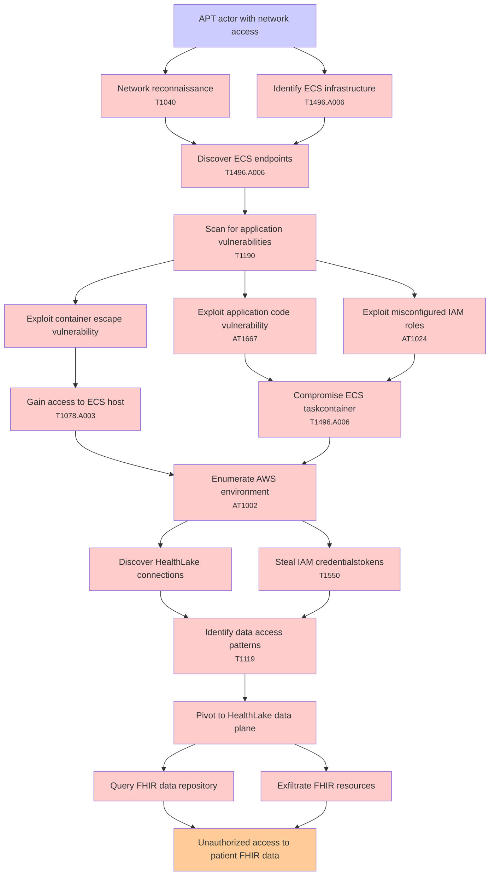

# Attack Tree: Lateral Movement

**Threat ID**: T003  
**Associated threat statement**: An advanced persistent threat actor with network access, can exploit vulnerabilities in custom applications running on Amazon ECS, which leads to lateral movement within the analytics platform, resulting in reduced confidentiality of FHIR data in Amazon HealthLake.

- **Threat Source**: advanced persistent threat actor
- **Prerequisites**: network access
- **Threat Action**: exploit vulnerabilities in custom applications running on Amazon ECS
- **Threat Impact**: lateral movement within the analytics platform
- **Reduced Goal**: confidentiality
- **Impacted Assets**: FHIR data in Amazon HealthLake
- **Priority**: High
- **Category**: Lateral Movement

---

## Attack Tree Diagram

## Attack Path Analysis

This attack tree represents the potential attack paths for the identified threat. Each node in the tree represents either:
- **Attack Goal** (orange): The ultimate objective
- **Attack Step** (red): Individual attack actions
- **Fact/Condition** (blue): Prerequisites or conditions
- **Mitigation** (green): Defensive measures

Review this attack tree to:
1. Identify critical attack paths
2. Implement appropriate security controls
3. Monitor for indicators of these attack patterns
4. Develop incident response procedures

---
*Generated by ThreatForest - Attack Tree Analysis*

---

## 🎯 Technique Mappings

| Attack Step | Technique ID | Technique Name | Kill Chain Phase | Confidence |
|-------------|--------------|----------------|------------------|------------|
| Compromise ECS taskcontainer | T1496.A006 | Compute Hijacking - ECS | impact | 0.474 |
| Identify ECS infrastructure | T1496.A006 | Compute Hijacking - ECS | impact | 0.501 |
| Discover ECS endpoints | T1496.A006 | Compute Hijacking - ECS | impact | 0.423 |
| Scan for application vulnerabilities | T1190 | Exploit Public-Facing Applicat... | initial-access | 0.416 |
| Identify data access patterns | T1119 | Automated Collection | collection | 0.462 |
| Exploit application code vulnerability | AT1667 | Application API Abuse | persistence | 0.497 |
| Enumerate AWS environment | AT1002 | AWS Systems Manager Run Comman... | execution | 0.513 |
| Exploit misconfigured IAM roles | AT1024 | IAM Principal Manipulation | persistence | 0.545 |
| Steal IAM credentialstokens | T1550 | Use Alternate Authentication M... | defense-evasion, lateral-movement | 0.570 |
| Network reconnaissance | T1040 | Network Sniffing | credential-access, discovery | 0.518 |
| Gain access to ECS host | T1078.A003 | Console Login | initial-access | 0.497 |
