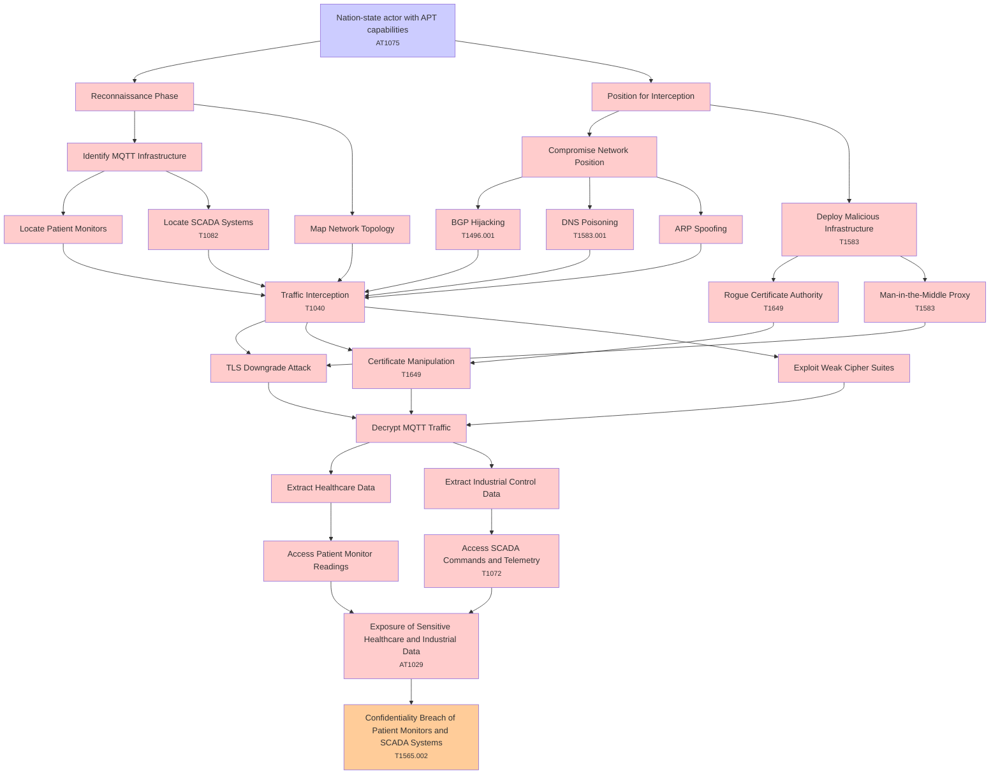

# Attack Tree: Cryptographic Failures

**Threat ID**: T002  
**Associated threat statement**: A nation-state actor with advanced persistent threat capabilities, can intercept and decrypt MQTT over TLS communications, which leads to exposure of sensitive healthcare and industrial data, resulting in reduced confidentiality of patient monitors and SCADA systems.

- **Threat Source**: nation-state actor
- **Prerequisites**: advanced persistent threat capabilities
- **Threat Action**: intercept and decrypt MQTT over TLS communications
- **Threat Impact**: exposure of sensitive healthcare and industrial data
- **Reduced Goal**: confidentiality
- **Impacted Assets**: patient monitors and SCADA systems
- **Priority**: High
- **Category**: Cryptographic Failures

---

## Attack Tree Diagram

## Attack Path Analysis

This attack tree represents the potential attack paths for the identified threat. Each node in the tree represents either:
- **Attack Goal** (orange): The ultimate objective
- **Attack Step** (red): Individual attack actions
- **Fact/Condition** (blue): Prerequisites or conditions
- **Mitigation** (green): Defensive measures

Review this attack tree to:
1. Identify critical attack paths
2. Implement appropriate security controls
3. Monitor for indicators of these attack patterns
4. Develop incident response procedures

---
*Generated by ThreatForest - Attack Tree Analysis*

---

## 🎯 Technique Mappings

| Attack Step | Technique ID | Technique Name | Kill Chain Phase | Confidence |
|-------------|--------------|----------------|------------------|------------|
| Nation-state actor with APT capabilities | AT1075 | Create Identity Provider | persistence, lateral-movement | 0.437 |
| BGP Hijacking | T1496.001 | Compute Hijacking | impact | 0.421 |
| Deploy Malicious Infrastructure | T1583 | Acquire Infrastructure | resource-development | 0.605 |
| Man-in-the-Middle Proxy | T1583 | Acquire Infrastructure | resource-development | 0.435 |
| Exposure of Sensitive Healthcare and Industrial Da... | AT1029 | Data from Cloud Database | collection | 0.474 |
| Access SCADA Commands and Telemetry | T1072 | Software Deployment Tools | execution, lateral-movement | 0.420 |
| Confidentiality Breach of Patient Monitors and SCA... | T1565.002 | Transmitted Data Manipulation | impact | 0.415 |
| Rogue Certificate Authority | T1649 | Steal or Forge Authentication ... | credential-access | 0.449 |
| Traffic Interception | T1040 | Network Sniffing | credential-access, discovery | 0.625 |
| Certificate Manipulation | T1649 | Steal or Forge Authentication ... | credential-access | 0.462 |
| DNS Poisoning | T1583.001 | Domains | resource-development | 0.559 |
| Locate SCADA Systems | T1082 | System Information Discovery | discovery | 0.421 |
