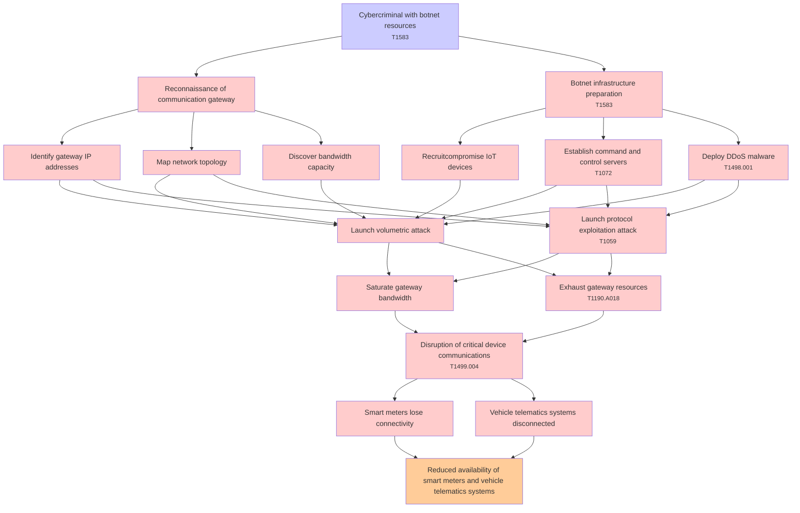

# Attack Tree: Denial of Service

**Threat ID**: T004  
**Associated threat statement**: A cybercriminal with botnet resources, can launch distributed denial-of-service attacks against the communication gateway, which leads to disruption of critical device communications, resulting in reduced availability of smart meters and vehicle telematics systems.

- **Threat Source**: cybercriminal
- **Prerequisites**: botnet resources
- **Threat Action**: launch distributed denial-of-service attacks against the communication gateway
- **Threat Impact**: disruption of critical device communications
- **Reduced Goal**: availability
- **Impacted Assets**: smart meters and vehicle telematics systems
- **Priority**: High
- **Category**: Denial of Service

---

## Attack Tree Diagram

## Attack Path Analysis

This attack tree represents the potential attack paths for the identified threat. Each node in the tree represents either:
- **Attack Goal** (orange): The ultimate objective
- **Attack Step** (red): Individual attack actions
- **Fact/Condition** (blue): Prerequisites or conditions
- **Mitigation** (green): Defensive measures

Review this attack tree to:
1. Identify critical attack paths
2. Implement appropriate security controls
3. Monitor for indicators of these attack patterns
4. Develop incident response procedures

---
*Generated by ThreatForest - Attack Tree Analysis*

---

## 🎯 Technique Mappings

| Attack Step | Technique ID | Technique Name | Kill Chain Phase | Confidence |
|-------------|--------------|----------------|------------------|------------|
| Botnet infrastructure preparation | T1583 | Acquire Infrastructure | resource-development | 0.604 |
| Launch protocol exploitation attack | T1059 | Command and Scripting Interpre... | execution | 0.440 |
| Exhaust gateway resources | T1190.A018 | API Gateway | initial-access | 0.418 |
| Establish command and control servers | T1072 | Software Deployment Tools | execution, lateral-movement | 0.430 |
| Deploy DDoS malware | T1498.001 | Direct Network Flood | impact | 0.591 |
| Disruption of critical device communications | T1499.004 | Application or System Exploita... | impact | 0.439 |
| Cybercriminal with botnet resources | T1583 | Acquire Infrastructure | resource-development | 0.517 |
