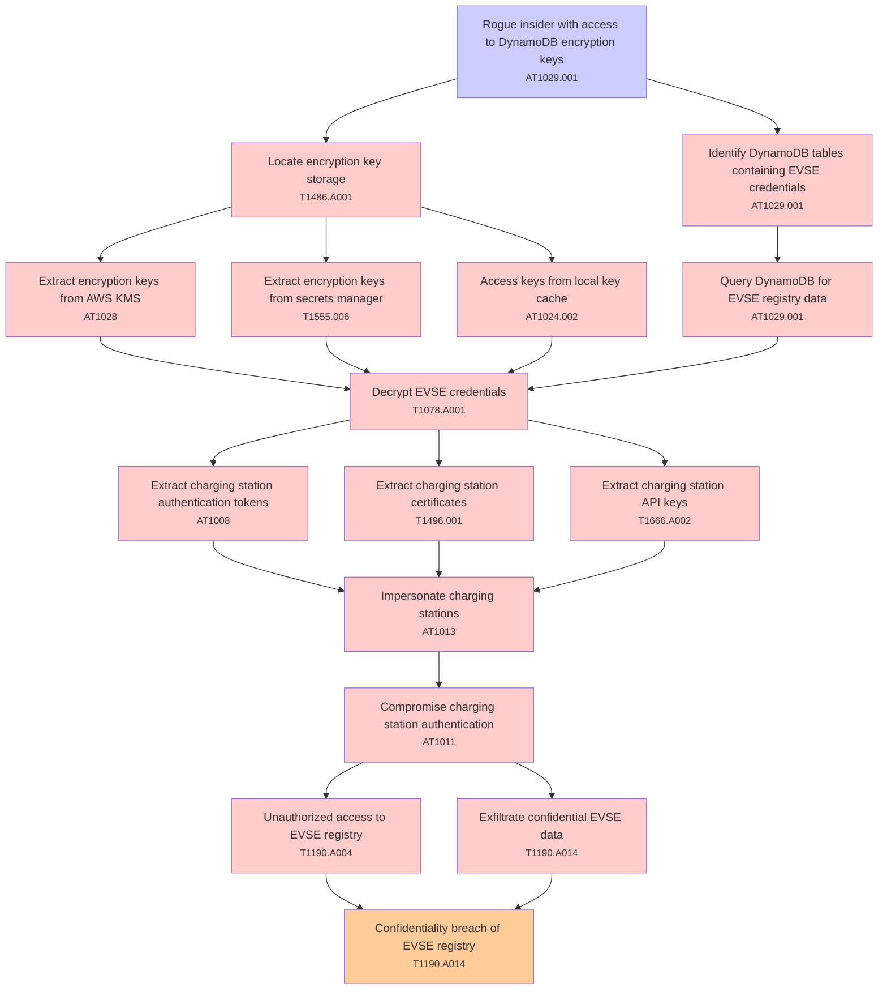

# Attack Tree: T002 - Data Exposure

**Threat ID**: T002  
**Description**: A rogue insider with access to DynamoDB encryption keys, can decrypt stored EVSE credentials, which leads to compromise of charging station authentication, resulting in reduced confidentiality of EVSE registry.

---

## Attack Tree Diagram

## Attack Path Analysis

This attack tree represents the potential attack paths for the identified threat. Each node in the tree represents either:
- **Attack Goal** (orange): The ultimate objective
- **Attack Step** (red): Individual attack actions
- **Fact/Condition** (blue): Prerequisites or conditions
- **Mitigation** (green): Defensive measures

Review this attack tree to:
1. Identify critical attack paths
2. Implement appropriate security controls
3. Monitor for indicators of these attack patterns
4. Develop incident response procedures

---
*Generated by ThreatForest - Attack Tree Analysis*

## TTC Technique Mappings

| Attack Step | Technique ID | Technique Name | Confidence | Similarity |
|-------------|--------------|----------------|------------|------------|
| Access keys from local key cache... | AT1024.002 | Additional Access Key... | 🟡 medium | 0.593 |
| Locate encryption key storage... | T1486.A001 | S3 Encryption - SSE-C Key Encryption... | 🟡 medium | 0.594 |
| Extract charging station authentication tokens... | AT1008 | Golden SAML... | 🟡 medium | 0.538 |
| Extract encryption keys from AWS KMS... | AT1028 | Create or Modify EC2 Key Pair... | 🟢 high | 0.720 |
| Extract charging station API keys... | T1666.A002 | Leave AWS Organization... | 🟡 medium | 0.512 |
| Compromise charging station authentication... | AT1011 | Operation Rate Control... | 🟡 medium | 0.542 |
| Decrypt EVSE credentials... | T1078.A001 | IAM Entities... | 🟡 medium | 0.548 |
| Exfiltrate confidential EVSE data... | T1190.A014 | EMR Cluster... | 🟡 medium | 0.594 |
| Confidentiality breach of EVSE registry... | T1190.A014 | EMR Cluster... | 🟡 medium | 0.552 |
| Rogue insider with access to DynamoDB encryption k... | AT1029.001 | DynamoDB... | 🟢 high | 0.854 |
| Query DynamoDB for EVSE registry data... | AT1029.001 | DynamoDB... | 🟡 medium | 0.653 |
| Unauthorized access to EVSE registry... | T1190.A004 | S3 Glacier Vault... | 🟡 medium | 0.588 |
| Extract encryption keys from secrets manager... | T1555.006 | Cloud Secrets Management Stores... | 🟡 medium | 0.622 |
| Extract charging station certificates... | T1496.001 | Compute Hijacking... | 🔴 low | 0.464 |
| Impersonate charging stations... | AT1013 | User Agent Spoofing and Randomization... | 🟡 medium | 0.607 |
| Identify DynamoDB tables containing EVSE credentia... | AT1029.001 | DynamoDB... | 🟢 high | 0.743 |
