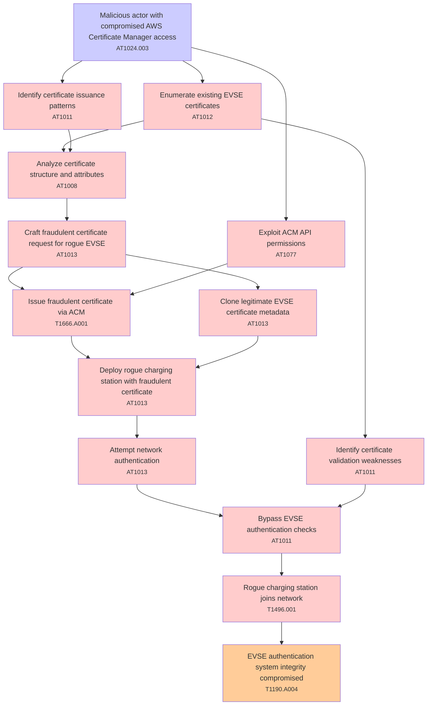

# Attack Tree: T004 - Certificate Management

**Threat ID**: T004  
**Description**: A malicious actor with compromised AWS Certificate Manager access, can issue fraudulent certificates for unauthorized EVSEs, which leads to rogue charging stations joining the network, resulting in reduced integrity of EVSE authentication system.

---

## Attack Tree Diagram

## Attack Path Analysis

This attack tree represents the potential attack paths for the identified threat. Each node in the tree represents either:
- **Attack Goal** (orange): The ultimate objective
- **Attack Step** (red): Individual attack actions
- **Fact/Condition** (blue): Prerequisites or conditions
- **Mitigation** (green): Defensive measures

Review this attack tree to:
1. Identify critical attack paths
2. Implement appropriate security controls
3. Monitor for indicators of these attack patterns
4. Develop incident response procedures

---
*Generated by ThreatForest - Attack Tree Analysis*

## TTC Technique Mappings

| Attack Step | Technique ID | Technique Name | Confidence | Similarity |
|-------------|--------------|----------------|------------|------------|
| Clone legitimate EVSE certificate metadata... | AT1013 | User Agent Spoofing and Randomization... | 🔴 low | 0.490 |
| Malicious actor with compromised AWS Certificate M... | AT1024.003 | IAM Role Hopping... | 🟢 high | 0.784 |
| Rogue charging station joins network... | T1496.001 | Compute Hijacking... | 🟡 medium | 0.550 |
| Craft fraudulent certificate request for rogue EVS... | AT1013 | User Agent Spoofing and Randomization... | 🟡 medium | 0.587 |
| Identify certificate validation weaknesses... | AT1011 | Operation Rate Control... | 🟡 medium | 0.566 |
| Analyze certificate structure and attributes... | AT1008 | Golden SAML... | 🔴 low | 0.461 |
| Identify certificate issuance patterns... | AT1011 | Operation Rate Control... | 🟡 medium | 0.564 |
| Bypass EVSE authentication checks... | AT1011 | Operation Rate Control... | 🟡 medium | 0.568 |
| Deploy rogue charging station with fraudulent cert... | AT1013 | User Agent Spoofing and Randomization... | 🟡 medium | 0.585 |
| Enumerate existing EVSE certificates... | AT1012 | Region Selection and Hopping... | 🔴 low | 0.437 |
| Attempt network authentication... | AT1013 | User Agent Spoofing and Randomization... | 🟡 medium | 0.534 |
| EVSE authentication system integrity compromised... | T1190.A004 | S3 Glacier Vault... | 🟡 medium | 0.591 |
| Issue fraudulent certificate via ACM... | T1666.A001 | Create Organization Account... | 🟡 medium | 0.568 |
| Exploit ACM API permissions... | AT1077 | Authorize VPC Security Groups... | 🟡 medium | 0.696 |
