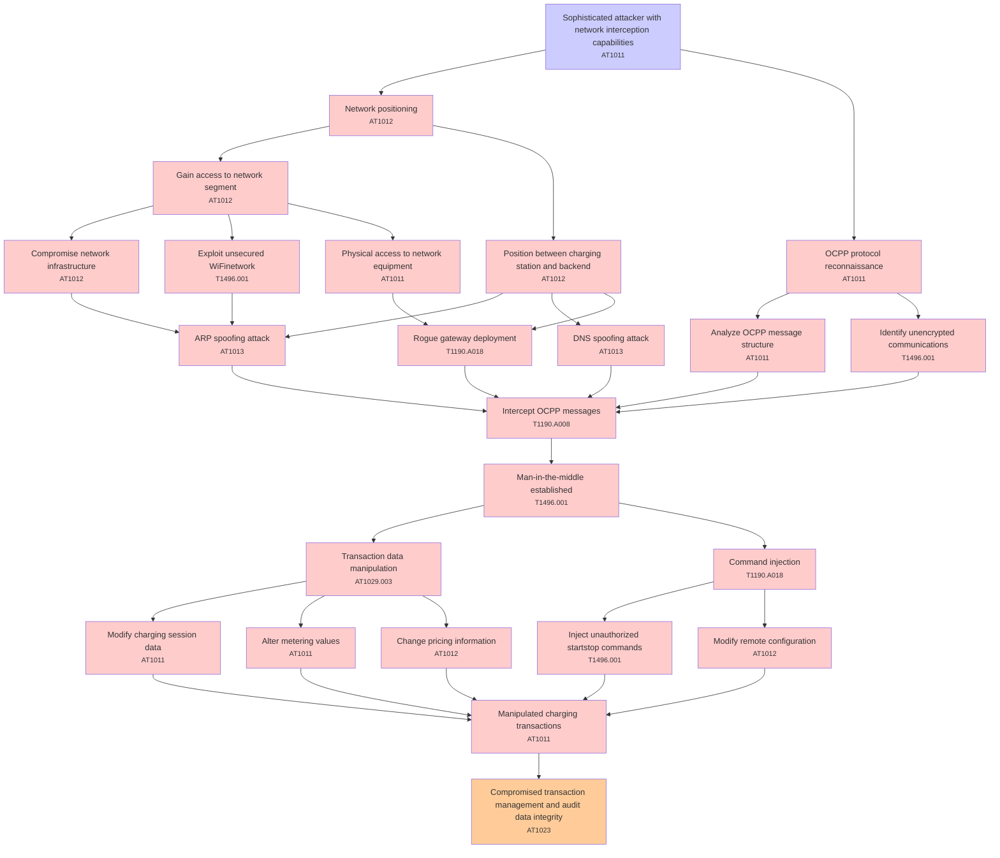

# Attack Tree: T003 - Communication Security

**Threat ID**: T003  
**Description**: A sophisticated attacker with network interception capabilities, can perform man-in-the-middle attacks on OCPP communications, which leads to manipulation of charging transactions, resulting in reduced integrity of transaction management and audit data.

---

## Attack Tree Diagram

## Attack Path Analysis

This attack tree represents the potential attack paths for the identified threat. Each node in the tree represents either:
- **Attack Goal** (orange): The ultimate objective
- **Attack Step** (red): Individual attack actions
- **Fact/Condition** (blue): Prerequisites or conditions
- **Mitigation** (green): Defensive measures

Review this attack tree to:
1. Identify critical attack paths
2. Implement appropriate security controls
3. Monitor for indicators of these attack patterns
4. Develop incident response procedures

---
*Generated by ThreatForest - Attack Tree Analysis*

## TTC Technique Mappings

| Attack Step | Technique ID | Technique Name | Confidence | Similarity |
|-------------|--------------|----------------|------------|------------|
| Sophisticated attacker with network interception c... | AT1011 | Operation Rate Control... | 🟡 medium | 0.635 |
| ARP spoofing attack... | AT1013 | User Agent Spoofing and Randomization... | 🟢 high | 0.705 |
| DNS spoofing attack... | AT1013 | User Agent Spoofing and Randomization... | 🟢 high | 0.721 |
| Manipulated charging transactions... | AT1011 | Operation Rate Control... | 🟡 medium | 0.548 |
| Network positioning... | AT1012 | Region Selection and Hopping... | 🟡 medium | 0.609 |
| Man-in-the-middle established... | T1496.001 | Compute Hijacking... | 🟡 medium | 0.643 |
| Identify unencrypted communications... | T1496.001 | Compute Hijacking... | 🟡 medium | 0.634 |
| Compromised transaction management and audit data ... | AT1023 | Cloud Database Discovery... | 🟡 medium | 0.657 |
| Command injection... | T1190.A018 | API Gateway... | 🟡 medium | 0.586 |
| Transaction data manipulation... | AT1029.003 | Redshift... | 🟡 medium | 0.566 |
| Position between charging station and backend... | AT1012 | Region Selection and Hopping... | 🟡 medium | 0.510 |
| Intercept OCPP messages... | T1190.A008 | CloudWatch Event Bus... | 🔴 low | 0.492 |
| OCPP protocol reconnaissance... | AT1011 | Operation Rate Control... | 🟡 medium | 0.654 |
| Analyze OCPP message structure... | AT1011 | Operation Rate Control... | 🔴 low | 0.447 |
| Change pricing information... | AT1012 | Region Selection and Hopping... | 🟡 medium | 0.513 |
| Compromise network infrastructure... | AT1012 | Region Selection and Hopping... | 🟡 medium | 0.597 |
| Rogue gateway deployment... | T1190.A018 | API Gateway... | 🟡 medium | 0.619 |
| Inject unauthorized startstop commands... | T1496.001 | Compute Hijacking... | 🔴 low | 0.481 |
| Exploit unsecured WiFinetwork... | T1496.001 | Compute Hijacking... | 🟡 medium | 0.629 |
| Alter metering values... | AT1011 | Operation Rate Control... | 🔴 low | 0.498 |
| Physical access to network equipment... | AT1011 | Operation Rate Control... | 🟡 medium | 0.567 |
| Gain access to network segment... | AT1012 | Region Selection and Hopping... | 🟡 medium | 0.607 |
| Modify remote configuration... | AT1012 | Region Selection and Hopping... | 🔴 low | 0.430 |
| Modify charging session data... | AT1011 | Operation Rate Control... | 🔴 low | 0.425 |
