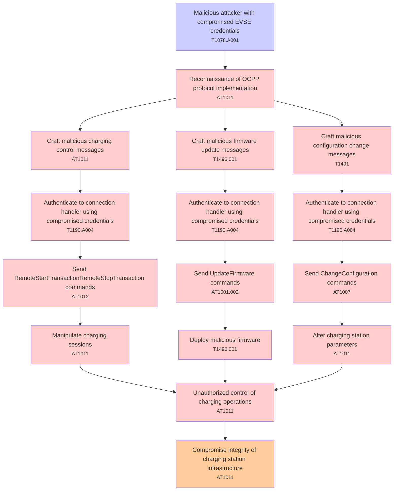

# Attack Tree: T001 - Authentication

**Threat ID**: T001  
**Description**: A malicious attacker with compromised EVSE credentials, can send malicious OCPP messages to the connection handler, which leads to unauthorized control of charging operations, resulting in reduced integrity of charging station infrastructure.

---

## Attack Tree Diagram

## Attack Path Analysis

This attack tree represents the potential attack paths for the identified threat. Each node in the tree represents either:
- **Attack Goal** (orange): The ultimate objective
- **Attack Step** (red): Individual attack actions
- **Fact/Condition** (blue): Prerequisites or conditions
- **Mitigation** (green): Defensive measures

Review this attack tree to:
1. Identify critical attack paths
2. Implement appropriate security controls
3. Monitor for indicators of these attack patterns
4. Develop incident response procedures

---
*Generated by ThreatForest - Attack Tree Analysis*

## TTC Technique Mappings

| Attack Step | Technique ID | Technique Name | Confidence | Similarity |
|-------------|--------------|----------------|------------|------------|
| Reconnaissance of OCPP protocol implementation... | AT1011 | Operation Rate Control... | 🟡 medium | 0.628 |
| Send ChangeConfiguration commands... | AT1007 | Create or Modify AWS Service... | 🔴 low | 0.428 |
| Deploy malicious firmware... | T1496.001 | Compute Hijacking... | 🟡 medium | 0.614 |
| Send RemoteStartTransactionRemoteStopTransaction c... | AT1012 | Region Selection and Hopping... | 🔴 low | 0.401 |
| Craft malicious charging control messages... | AT1011 | Operation Rate Control... | 🟡 medium | 0.593 |
| Craft malicious firmware update messages... | T1496.001 | Compute Hijacking... | 🟡 medium | 0.549 |
| Alter charging station parameters... | AT1011 | Operation Rate Control... | 🟡 medium | 0.539 |
| Unauthorized control of charging operations... | AT1011 | Operation Rate Control... | 🟡 medium | 0.620 |
| Send UpdateFirmware commands... | AT1001.002 | Modify Existing Lambda Function... | 🔴 low | 0.364 |
| Manipulate charging sessions... | AT1011 | Operation Rate Control... | 🟡 medium | 0.502 |
| Craft malicious configuration change messages... | T1491 | Defacement... | 🟡 medium | 0.534 |
| Compromise integrity of charging station infrastru... | AT1011 | Operation Rate Control... | 🟡 medium | 0.546 |
| Authenticate to connection handler using compromis... | T1190.A004 | S3 Glacier Vault... | 🟡 medium | 0.593 |
| Malicious attacker with compromised EVSE credentia... | T1078.A001 | IAM Entities... | 🟡 medium | 0.616 |
